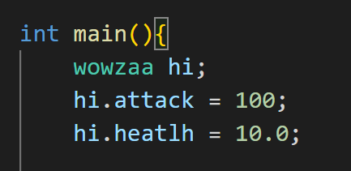

# stuct 

คือ การวม หรือ รวบ ข้อมูลหลายๆประเภทมาอยู่ด้วยกัน ใช่ มันมีแค่นั้นจริงๆ
เช่นๆ 

ประกาศ stuct มาตัวนึง ที่มีชื่อ wowzaa

จากนั้นบอกว่า ให้ในก้อน wowzaa นี้มีตัวแปรหลายๆ ตัว เช่น 

จากภาพจะเห็นว่า ใน wowzaa จะมีตัวแปรหลายๆ ตัวและ หลายๆประเภท 

โดยเราจะสามารถเรียกใช้ค่าต่างได้ดังนี้

จากนั้นจึงเรียกใช้อย่างนี้ๆ 

